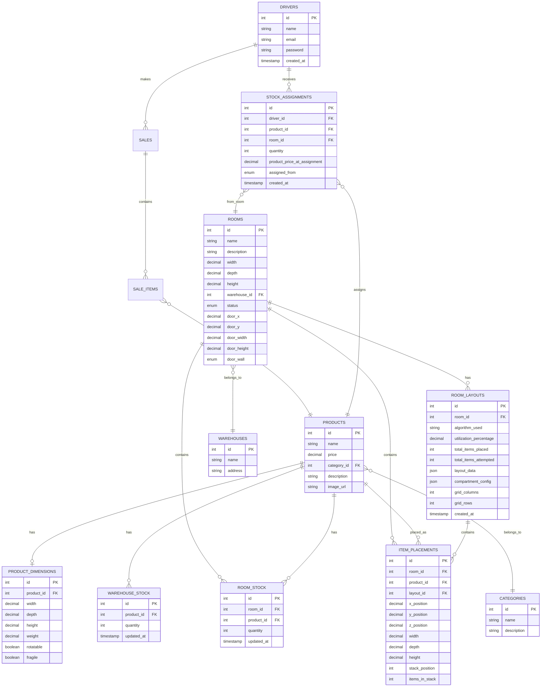

# Room Layout Generation Algorithms & Architecture Documentation

## Table of Contents

1. [System Overview](#system-overview)
2. [Architecture Diagram](#architecture-diagram)
3. [Layout Generation Flow](#layout-generation-flow)
4. [Validation Flow](#validation-flow)
5. [Grid Calculation Algorithms](#grid-calculation-algorithms)
6. [Packing Strategies](#packing-strategies)
7. [Database Schema (ERD)](#database-schema-erd)
8. [Component Interactions](#component-interactions)
9. [Fallback Mechanisms](#fallback-mechanisms)
10. [Algorithm Selection Logic](#algorithm-selection-logic)

---

## System Overview

The Room Layout Generation System is an intelligent warehouse management solution that automatically calculates optimal product placement within storage rooms. The system uses advanced algorithms to maximize space utilization while ensuring products fit correctly and stock availability is validated.

### Key Features

- **Smart Grid Calculation**: Dimension-based grid optimization
- **Multiple Packing Strategies**: Compartment, LAFF, and Hybrid approaches
- **Pre-Generation Validation**: Room and stock validation before layout creation
- **Real-time Feedback**: Live validation and preview in UI
- **Adaptive Algorithms**: Automatic strategy selection based on product mix

---

## Architecture Diagram

---

## Layout Generation Flow

---

## Validation Flow

---

## Grid Calculation Algorithms

### Grid Calculation Strategy Details

#### 1. Size-Based Strategy
- Groups products into small, medium, large categories
- Calculates minimum cell size based on largest product
- Optimizes for minimal waste per cell

#### 2. Aspect Ratio Strategy
- Matches grid cell aspect ratio to product aspect ratios
- Considers room aspect ratio
- Optimizes for visual consistency

#### 3. Density Optimized Strategy
- Maximizes space utilization
- Considers both volume and floor area
- Targets 85%+ utilization

---

## Packing Strategies

### Compartment Packing Flow

### LAFF Packing Flow

### Hybrid Packing Flow

---

## Database Schema (ERD)

---

## Component Interactions

---

## Fallback Mechanisms

### Fallback Hierarchy

1. **Primary**: Smart Grid Calculator with optimal strategy
2. **Fallback 1**: Simple grid calculation based on room aspect ratio
3. **Fallback 2**: Basic division (room width/columns, room depth/rows)
4. **Final Fallback**: Return error with detailed message

---

## Algorithm Selection Logic

---

## Grid Calculation Detailed Process

---

## Placement Strategy Selection

---

## Optimization Process

---

## Error Handling & Recovery

---

## Summary

This documentation describes a comprehensive room layout generation system with:

1. **Multiple Algorithms**: Compartment, LAFF, and Hybrid strategies
2. **Smart Grid Calculation**: Dimension-based optimization with fallbacks
3. **Comprehensive Validation**: Room, product, and stock validation
4. **Real-time Feedback**: Live validation and preview
5. **Optimization**: Post-generation layout optimization
6. **Robust Error Handling**: Multiple fallback mechanisms

The system is designed to maximize space utilization while ensuring all constraints are met and providing clear feedback to users throughout the process.
